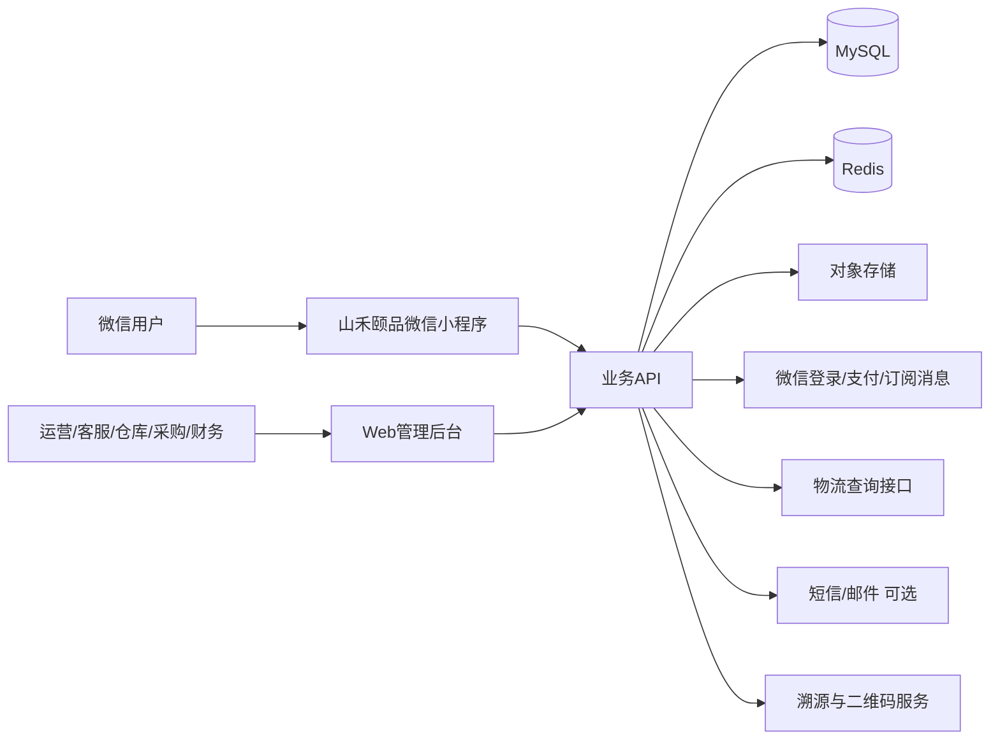

# 山禾颐品小程序项目文档 v1.0

> 文档定位：先做产品与技术设计，不生成程序代码。  
> 项目：山禾颐品微信小程序 + 运营管理后台 + 供应链/库存后台  
> 首发业务：甘肃舟曲柿饼/吊柿；后续扩展西北精选农特产品  
> 版本：v1.0  
> 日期：2026-09-19

---

## 1. 项目目标

山禾颐品小程序不是一个单纯的“商品展示页”，而是一套围绕农特产品品牌经营的轻量级数字化系统，覆盖：

1. 用户端商城；
2. 品牌内容与产地故事；
3. 商品、SKU、礼盒、袋装、试吃装；
4. 预售、优惠券、积分、会员、活动；
5. 购物车、下单、微信支付、发货、物流；
6. 退款、退货、补发、赔付与售后；
7. 企业礼品/团购询价；
8. 一物一码/一盒一码溯源；
9. 采购、供应商、批次、质检、分级；
10. 散货到成品的加工/包装转换；
11. 多仓位、库存锁定、盘点、损耗、残次；
12. 内容、消息、客服、评价、收藏、足迹；
13. 运营后台、仓库后台、财务对账、数据统计；
14. 权限、审计、安全、备份、监控与发布。

---

## 2. 产品定位

### 2.1 面向消费者

主要用户：
- 一二线城市年轻消费者；
- 注重产地、品质、包装、文化感的用户；
- 节日送礼用户；
- 想尝鲜西北特色农产品的用户；
- 企业行政、采购、福利负责人。

### 2.2 品牌表达

小程序必须同时承担三种角色：

- **商城**：把商品顺畅卖出去；
- **品牌馆**：讲清产地、工艺、人物和产品差异；
- **信任系统**：通过批次、溯源、包装视频、质检信息建立可信度。

---

## 3. 总体系统边界

---

## 4. 文档目录

| 文件 | 用途 |
|---|---|
| `01_产品需求_PRD.md` | 产品目标、用户、场景、范围、优先级 |
| `02_功能清单与页面地图.md` | 小程序与后台的完整功能树 |
| `03_角色权限与业务流程.md` | 用户角色、后台角色、业务状态机 |
| `04_技术架构设计.md` | 前后端、数据库、缓存、部署、第三方集成 |
| `05_数据库_ER与表设计.md` | 数据域、ER关系、核心表与关键字段 |
| `06_API设计规范.md` | API分组、认证、幂等、错误码、接口清单 |
| `07_商品采购仓储库存设计.md` | SKU、批次、采购、加工、损耗、库存 |
| `08_订单支付退款售后设计.md` | 下单、支付、发货、退款、补发、赔付 |
| `09_会员营销内容溯源企业团购.md` | 会员、优惠券、积分、内容、二维码、B2B |
| `10_运营后台数据报表.md` | 后台模块、指标、仪表盘、导入导出 |
| `11_安全合规部署运维.md` | 安全、隐私、日志、备份、发布、监控 |
| `12_测试验收与里程碑.md` | 测试、验收、MVP、二期、三期 |
| `13_GitHub参考项目与借鉴说明.md` | 参考案例、许可证提醒、借鉴模块 |
| `14_AI开发交接说明.md` | 后续交给 Codex/Claude 的执行规则 |

---

## 5. 建议技术路线

为降低小团队开发与长期维护成本，v1 推荐：

- 小程序端：`uni-app + Vue 3 + TypeScript`
- 管理后台：`Vue 3 + TypeScript + Element Plus`
- 后端：`NestJS + TypeScript`
- ORM：`Prisma`
- 主数据库：`MySQL 8`
- 缓存/分布式锁：`Redis`
- 文件：腾讯云 COS / 阿里云 OSS / 兼容 S3 的对象存储
- 部署：`Docker Compose + Nginx`
- 接口文档：OpenAPI / Swagger
- 日志：结构化日志 + 操作审计日志
- CI/CD：GitHub Actions（或后续国内 CI）
- 监控：应用健康检查 + 错误报警 + 数据库备份

选择全 TypeScript 的主要原因：
- 前端、后台、后端语言统一；
- 更适合两三人团队和 AI 辅助开发；
- 业务迭代速度快；
- 后续如订单量显著增加，可逐步拆服务，而不是一开始就微服务。

> 这不是要求照搬某个开源项目的技术栈，而是参考成熟电商的业务模型后，选择更适合山禾颐品当前规模的实现方式。

---

## 6. 版本策略

### P0：必须上线

- 微信登录；
- 首页；
- 分类；
- 商品与 SKU；
- 购物车；
- 地址；
- 订单；
- 微信支付；
- 发货/物流；
- 售后；
- 优惠券；
- 预售；
- 内容/品牌故事；
- 溯源；
- 企业团购表单；
- 商品/订单/会员后台；
- 采购、批次、基础库存；
- 损耗与盘点；
- 角色权限与日志。

### P1：增强转化

- 会员等级；
- 积分；
- 收藏/足迹；
- 商品评价；
- 订阅消息；
- 试吃官活动；
- 组合套装；
- 满减/满赠；
- 裂变分享；
- 客服工作台；
- 经营报表。

### P2：规模化

- 多仓；
- 供应商协同；
- 企业客户报价/合同；
- 分销员；
- 拼团/秒杀；
- 一人一码包装视频；
- 自动补货建议；
- 财务利润分析；
- 多平台订单；
- ERP/WMS 对接。

---

## 7. 核心原则

1. **订单与库存必须可追溯**：每个订单最终能追到商品 SKU、生产/采购批次与出库批次。
2. **库存不能只存一个数字**：必须有库存流水。
3. **支付回调必须幂等**：重复通知不能重复改订单、重复加积分。
4. **退款与售后分开建模**：退款不等于退货。
5. **预售订单不能按现货逻辑处理**。
6. **农产品损耗必须成为正式业务数据**。
7. **礼盒包装属于生产/转换过程**，不能简单把散货库存“手改少”。
8. **二维码溯源信息来自真实批次数据**。
9. **所有后台关键操作必须留审计日志**。
10. **第一期保持模块化单体，不急着上微服务**。
