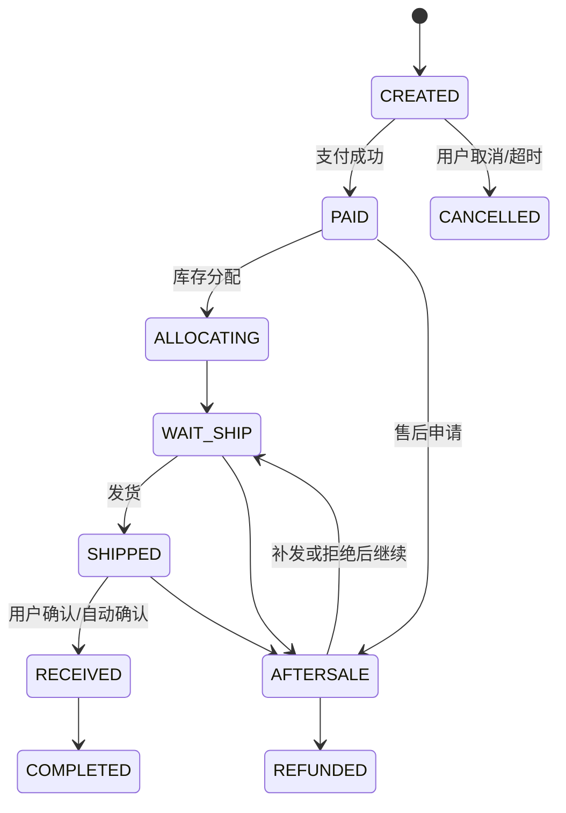
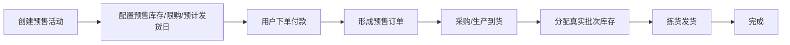
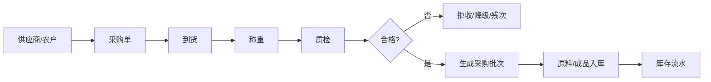
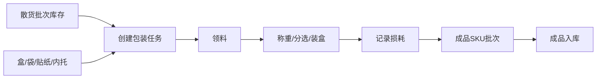
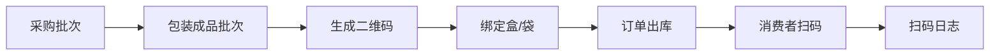

# 角色权限与核心业务流程

## 1. RBAC 角色

| 角色 | 主要权限 |
|---|---|
| 超级管理员 | 全部 |
| 运营 | 商品、内容、活动、会员、报表 |
| 客服 | 订单查看、售后、补发、用户备注 |
| 仓库 | 入库、出库、拣货、盘点、损耗 |
| 采购 | 供应商、采购、收货协同 |
| 财务 | 支付、退款、对账、财务报表 |
| 内容编辑 | 内容、Banner、专题，不可看财务 |
| 数据观察员 | 只读报表 |

权限拆分：
- 菜单权限；
- 按钮权限；
- API 权限；
- 数据权限；
- 敏感字段权限；
- 导出权限。

---

## 2. 订单主状态机

订单状态与售后状态不要混成一个字段。

---

## 3. 支付状态

- UNPAID；
- PAYING；
- PAID；
- PAY_FAILED；
- PART_REFUNDED；
- REFUNDED；
- CLOSED。

支付单和业务订单必须分表。

---

## 4. 预售流程

预售要求：
- 商品页醒目标明预计发货时间；
- 订单保留预售活动 ID；
- 预售可设置单独的售后/取消规则；
- 采购计划可读取预售销量；
- 不允许把“预售可售数量”与“实际现货数量”混用。

---

## 5. 采购与入库流程

---

## 6. 散货到礼盒加工流程

例：采购到的是成品散装柿饼，之后装为 8 枚盒/16 枚盒/28 枚礼盒。

必须记录：
- 原批次；
- 使用重量/数量；
- 包材数量；
- 成品数量；
- 工序损耗；
- 操作人；
- 日期；
- 成品批次。

---

## 7. 下单库存流程

正确原则：

1. 商品展示读取“可售库存”；
2. 提交订单时原子锁库存；
3. 未支付订单超时释放；
4. 支付成功后库存从“锁定”转为“待出库”；
5. 出库完成后扣减实物库存；
6. 售后退货质检通过后才决定是否重新进入可售库存。

库存建议指标：

`实物库存 = 可售 + 锁定 + 待出库 + 冻结 + 残次`

---

## 8. 售后流程

### 仅退款
适合：
- 未发货取消；
- 部分赔付；
- 无需退货的品质补偿。

### 退货退款
流程：
申请 → 审核 → 用户退货 → 收货 → 质检 → 退款 → 库存处置。

### 补发
必须建立“补发单”，不能只在订单备注写一句“已补发”。

### 赔付
支持：
- 部分退款；
- 优惠券；
- 积分；
- 补发。

---

## 9. 溯源流程

P2 一盒一码可进一步绑定：
- 装盒视频；
- 操作时间；
- 包装任务；
- 出库订单（对消费者脱敏）。
