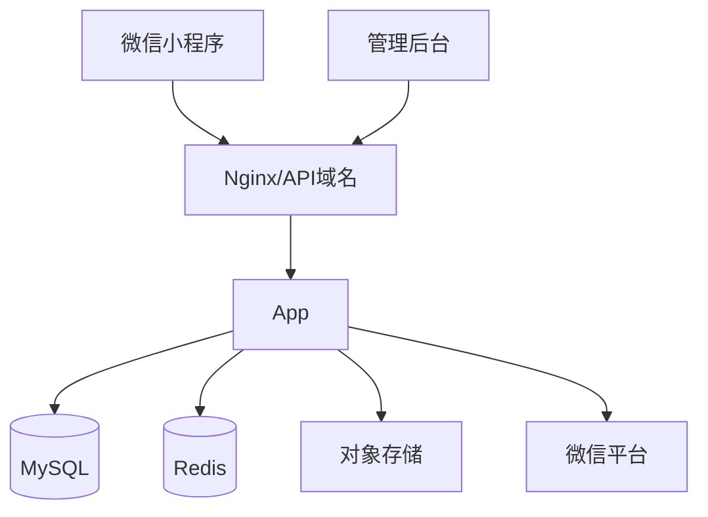

# 技术架构设计

## 1. 架构原则

当前阶段采用**模块化单体 + 独立前端**，不建议一开始做微服务。

理由：
- 订单规模尚未达到必须拆分服务的程度；
- 小团队开发和运维成本更低；
- 事务一致性更容易保证；
- 未来可以按模块边界拆分。

---

## 2. 推荐技术栈

### 小程序

- uni-app；
- Vue 3；
- TypeScript；
- Pinia；
- 微信小程序 API；
- 请求层统一封装；
- 自定义组件库。

若未来确定只做微信且追求微信原生能力极致，可改为原生小程序；业务 API 不受影响。

### Web 管理后台

- Vue 3；
- TypeScript；
- Vite；
- Element Plus；
- Pinia；
- Vue Router；
- ECharts。

### 后端

- Node.js LTS；
- NestJS；
- TypeScript；
- Prisma；
- OpenAPI；
- 参数校验；
- JWT/Session + RBAC；
- BullMQ（异步任务可选）。

### 数据

- MySQL 8；
- Redis；
- 对象存储；
- CDN。

---

## 3. 后端模块

```text
src/
  auth/
  users/
  members/
  catalog/
  products/
  pricing/
  carts/
  checkout/
  orders/
  payments/
  refunds/
  aftersales/
  shipping/
  marketing/
  coupons/
  points/
  content/
  traceability/
  enterprise/
  suppliers/
  procurement/
  warehouse/
  inventory/
  processing/
  finance/
  analytics/
  notifications/
  files/
  admin/
  audit/
  system/
```

模块之间通过服务接口调用，不允许任意跨模块直接修改数据表。

---

## 4. 数据架构

### MySQL

存储：
- 用户；
- 商品；
- 订单；
- 支付；
- 库存；
- 批次；
- 采购；
- 售后；
- 营销；
- 内容；
- 企业询价；
- 权限；
- 审计。

### Redis

用于：
- 登录态/临时 token；
- 商品热点缓存；
- 分布式锁；
- 防重复提交；
- 短期库存锁；
- 限流；
- 异步任务状态。

Redis 不是订单和库存事实数据的最终来源。

### 对象存储

- 商品图片；
- 内容图片；
- 视频；
- 售后凭证；
- 质检附件；
- 企业合同附件；
- 装盒视频。

---

## 5. 第三方服务

### 必须

- 微信小程序登录；
- 微信支付；
- 微信订阅消息；
- 对象存储；
- 物流查询。

### 可选

- 短信；
- OCR；
- 电子面单；
- 发票服务；
- 企业微信；
- BI。

---

## 6. 下单一致性

下单核心流程：

1. 验证用户；
2. 验证地址；
3. 拉取服务端实时商品价格；
4. 验证活动；
5. 验证优惠券；
6. 计算运费；
7. 计算应付；
8. 锁库存；
9. 创建订单；
10. 创建支付单；
11. 返回支付参数。

禁止以前端提交的总价作为订单最终金额。

---

## 7. 支付回调设计

微信支付回调必须：

- 验签；
- 验金额；
- 验商户订单号；
- 幂等；
- 事务处理；
- 保存原始通知摘要；
- 异常可重试；
- 成功后异步发消息/积分等。

---

## 8. 事件设计

内部可以使用事件驱动，但第一期不需要独立消息中间件。

事件示例：

- `OrderPaid`
- `OrderCancelled`
- `OrderShipped`
- `RefundSucceeded`
- `StockLow`
- `PurchaseReceived`
- `ProcessingCompleted`
- `TraceCodeScanned`

后续订单量增长可迁移到 RabbitMQ/Kafka。

---

## 9. 定时任务

- 未付款订单自动关闭；
- 释放库存；
- 自动确认收货；
- 优惠券过期；
- 预售履约提醒；
- 库存预警；
- 数据聚合；
- 备份检查；
- 失效二维码/异常扫码检查；
- 企业询价跟进提醒。

---

## 10. 环境

```text
dev       本地开发
test      集成测试
staging   预发布
prod      正式
```

密钥必须放环境变量/Secret，不进入 Git。

---

## 11. 部署拓扑



初期一台云服务器即可承载 Nginx + App + Redis；MySQL 可同机起步，但生产更建议独立数据库/托管数据库并做自动备份。
