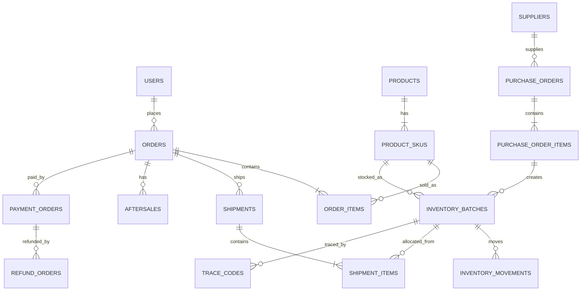

# 数据库 ER 与表设计

## 1. 设计原则

- 主键推荐雪花 ID / UUID / bigint；
- 金额统一使用“分”存整数；
- 重量统一使用明确最小单位，例如克；
- 时间统一存 UTC 或固定时区并在应用层转换；
- 所有核心业务表有 `created_at`、`updated_at`；
- 关键业务使用逻辑状态，不直接删除；
- 库存必须有流水表；
- 支付必须独立支付单；
- 售后必须独立售后单；
- 批次必须独立实体。

---

## 2. 主要数据域

### 用户

- `users`
- `user_wechat_accounts`
- `user_phones`
- `user_addresses`
- `member_levels`
- `member_points_accounts`
- `member_points_logs`
- `user_tags`
- `favorites`
- `browsing_histories`

### 商品

- `categories`
- `products`
- `product_skus`
- `product_specs`
- `product_spec_values`
- `sku_spec_relations`
- `product_media`
- `product_tags`
- `freight_templates`
- `product_sales_rules`

### 购物车与交易

- `carts`
- `cart_items`
- `orders`
- `order_items`
- `order_addresses`
- `order_price_details`
- `order_status_logs`
- `shipments`
- `shipment_items`
- `logistics_tracks`

### 支付退款

- `payment_orders`
- `payment_transactions`
- `refund_orders`
- `refund_transactions`

### 售后

- `aftersales`
- `aftersale_items`
- `aftersale_evidence`
- `aftersale_logs`
- `reship_orders`

### 营销

- `coupons`
- `coupon_batches`
- `user_coupons`
- `promotions`
- `promotion_rules`
- `presale_campaigns`
- `presale_sku_rules`
- `bundle_products`

### 内容

- `articles`
- `article_categories`
- `topics`
- `banners`
- `content_product_relations`

### 供应商采购

- `suppliers`
- `supplier_contacts`
- `purchase_orders`
- `purchase_order_items`
- `purchase_receipts`
- `purchase_receipt_items`
- `quality_inspections`

### 仓储库存

- `warehouses`
- `warehouse_locations`
- `inventory_batches`
- `inventory_balances`
- `inventory_reservations`
- `inventory_movements`
- `stocktakes`
- `stocktake_items`
- `inventory_losses`

### 加工包装

- `packaging_boms`
- `packaging_bom_items`
- `processing_orders`
- `processing_material_issues`
- `processing_outputs`
- `processing_losses`

### 溯源

- `trace_batches`
- `trace_codes`
- `trace_code_bindings`
- `trace_scan_logs`
- `trace_media`

### 企业团购

- `enterprise_leads`
- `enterprise_customers`
- `enterprise_quotes`
- `enterprise_quote_items`
- `enterprise_followups`
- `enterprise_orders`
- `enterprise_delivery_addresses`

### 管理系统

- `admin_users`
- `roles`
- `permissions`
- `role_permissions`
- `admin_user_roles`
- `audit_logs`
- `login_logs`
- `system_configs`

---

## 3. 核心 ER

---

## 4. 核心表字段示例

### products

- id
- category_id
- name
- subtitle
- product_type
- status
- content
- origin
- sort_order

### product_skus

- id
- product_id
- sku_code
- sku_name
- sale_price_cent
- market_price_cent
- weight_gram
- barcode
- sale_status
- stock_mode
- presale_enabled

### inventory_batches

- id
- batch_no
- sku_id / material_id
- supplier_id
- purchase_receipt_id
- production_date
- received_date
- expiry_date
- grade
- quality_status
- warehouse_id
- location_id
- unit_cost_cent
- trace_batch_id

### inventory_balances

- id
- warehouse_id
- location_id
- sku_id
- batch_id
- physical_qty
- available_qty
- reserved_qty
- outbound_qty
- frozen_qty
- defective_qty
- version

### inventory_movements

- id
- movement_no
- movement_type
- sku_id
- batch_id
- warehouse_id
- location_id
- qty_change
- qty_before
- qty_after
- related_type
- related_id
- operator_id
- reason
- created_at

### orders

- id
- order_no
- user_id
- order_type
- order_status
- payment_status
- fulfillment_status
- aftersale_status
- goods_amount_cent
- discount_amount_cent
- freight_amount_cent
- payable_amount_cent
- paid_amount_cent
- presale_campaign_id
- paid_at
- shipped_at
- completed_at

### order_items

必须保存下单时快照：
- product_id
- sku_id
- product_name_snapshot
- sku_name_snapshot
- image_snapshot
- unit_price_cent
- qty
- discount_cent
- final_amount_cent

即使以后商品改名、改价，历史订单仍能正确显示。

---

## 5. 数据库索引重点

- `orders(order_no)` 唯一；
- `orders(user_id, created_at)`；
- `orders(order_status, created_at)`；
- `product_skus(sku_code)` 唯一；
- `inventory_batches(batch_no)` 唯一；
- `inventory_balances(sku_id, warehouse_id, batch_id)`；
- `inventory_movements(sku_id, created_at)`；
- `trace_codes(code)` 唯一；
- `payment_orders(payment_no)` 唯一；
- `payment_transactions(platform_transaction_id)` 唯一。

---

## 6. 并发

库存更新使用：
- 数据库事务；
- 乐观锁 `version`；
- 必要场景 Redis 分布式锁；
- 唯一约束；
- 幂等键。

不能只依赖 Redis 锁保证账实一致。
